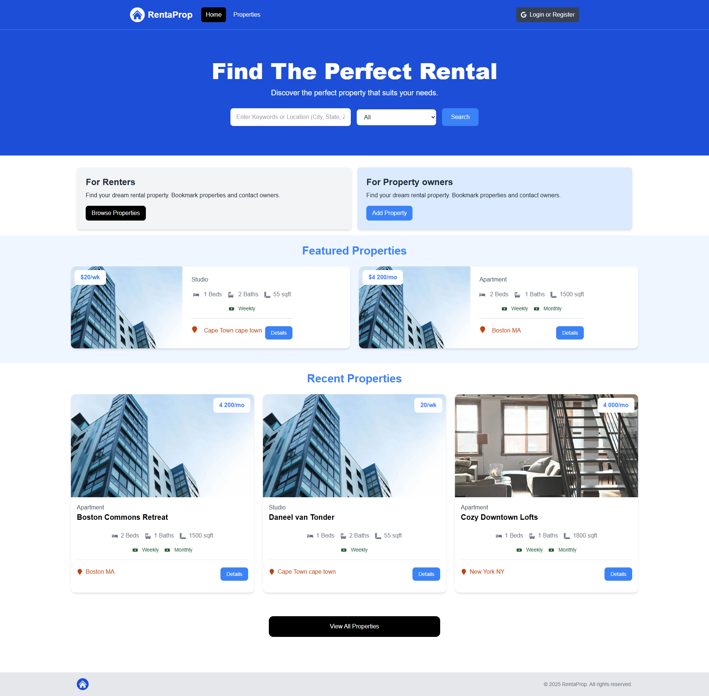
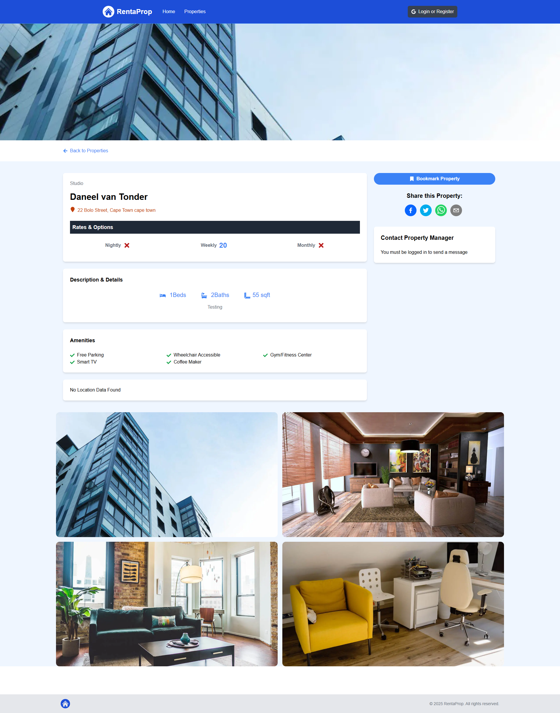

# 🚀 Rent a Prop

> Website where users can add and view properties that is up for rental.

[](LICENSE)
[]()

---

## 📸 Demo / Screenshots

<p align="center">
  
  
</p>

---

## 📜 About

A website where users can list and browse properties available for rent.

---

## ✨ Features

- ✅ Log in log out user
- ✅ Add property
- ✅ View properties
- ✅ Contact property owner
- ✅ Delete properties

---

## 🛠 Tech Stack

**Frontend:** Next.js, TailwindCSS, Mapbox, photoswipe, react-share
**Backend:** Next.js, cloudinary
**Database:** MongoDB

---

## ⚙️ Installation

### You will have to register with some third party software companies

- **Data storage:** Cloudinary
- **Maps:** Mapbox
- **Database:** Atlas Mongo DB
- **Authentication** Google

```bash
# Create a .env file
NEXT_PUBLIC_DOMAIN="http://localhost:3000"
NEXT_PUBLIC_API_DOMAIN="http://localhost:3000/api"

NEXTAUTH_URL="http://localhost:3000"
NEXTAUTH_URL_INTERNAL="http://localhost:3000"
NEXTAUTH_SECRET=""

MONGODB_URI="<Mongoose Connection String>"

GOOGLE_CLIENT_ID=""

CLOUDINARY_CLOUD_NAME=""
CLOUDINARY_API_KEY=""
CLOUDINARY_SECRET=""

NEXT_PUBLIC_MAPBOX_TOKEN=""
NEXT_PUBLIC_GOOGLE_GEOCODING_API_KEY=""

# Clone the repo
git clone https://github.com/Daneelv/rent-a-prop.git

# Install dependencies
npm install

# Run locally
npm run dev
```
